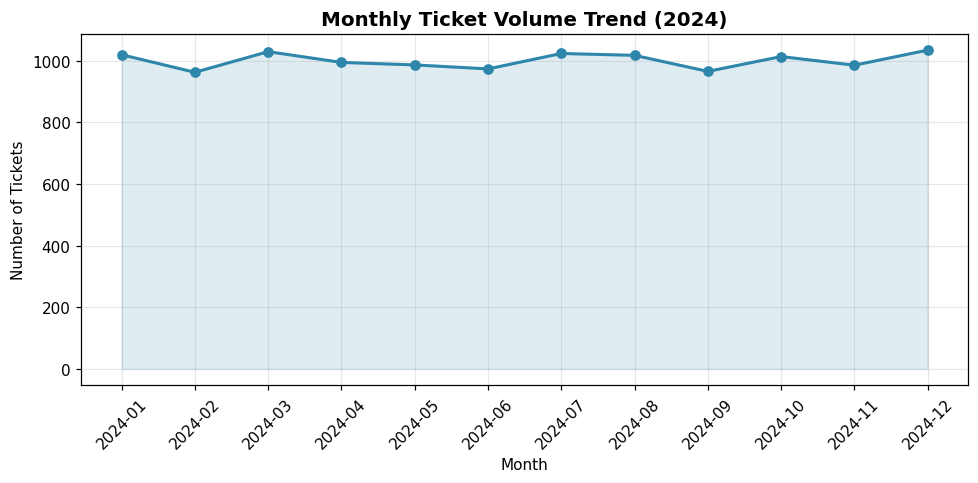
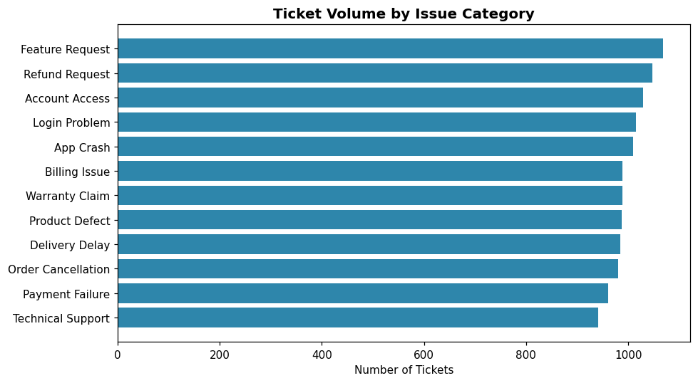
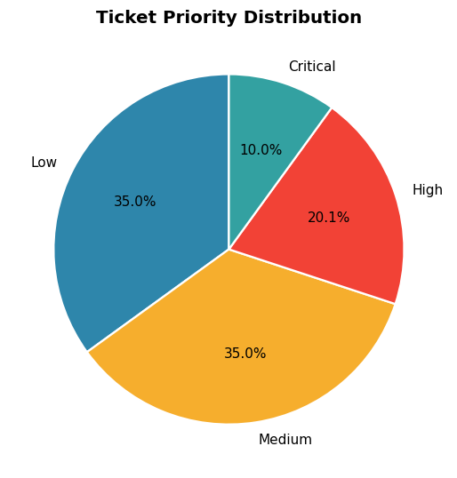
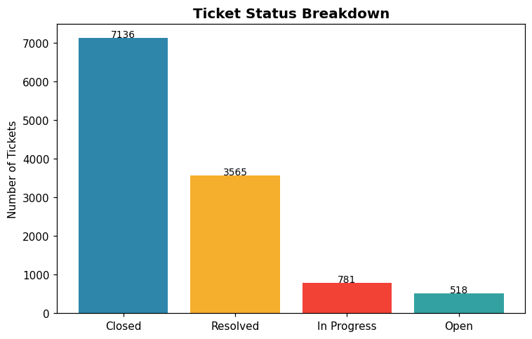
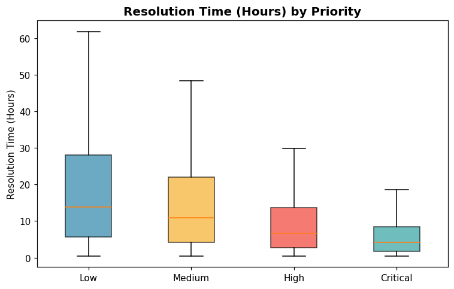
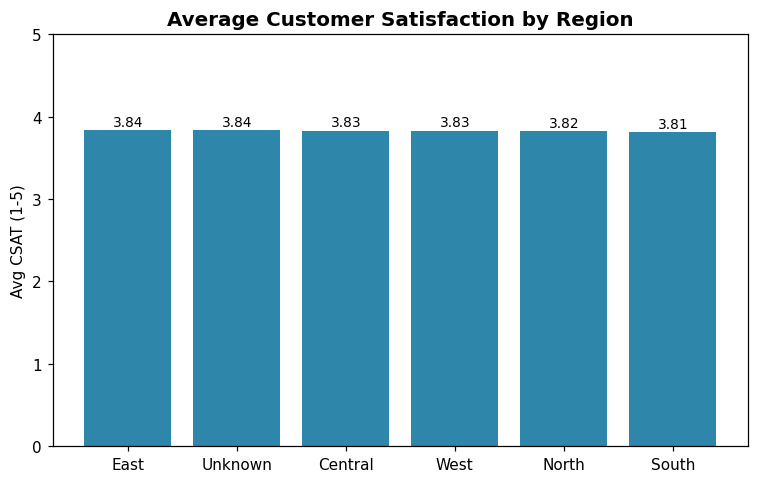
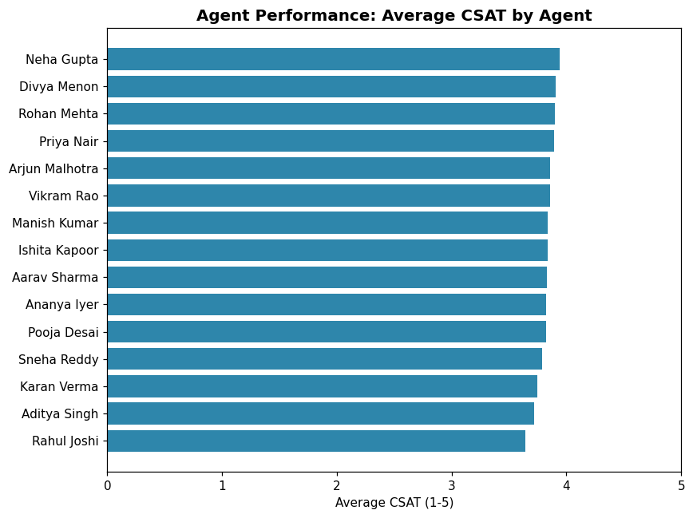
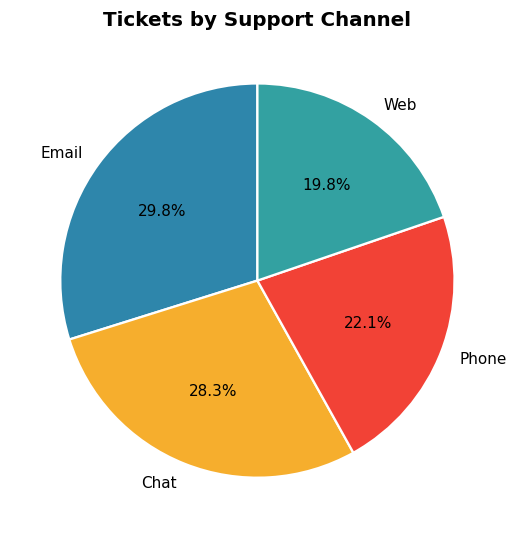
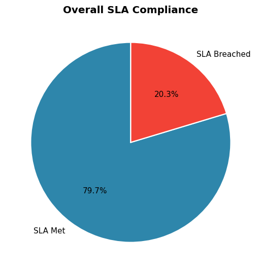
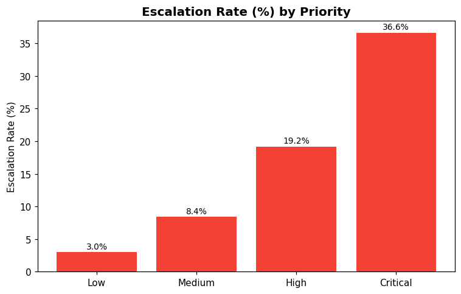

# 🎧 Customer Support Ticket Analysis

**An end-to-end data analytics project** analyzing 12,000+ customer support
tickets to uncover trends, measure support team performance, identify
operational bottlenecks, and deliver actionable business recommendations —
built to reflect real-world analytics work at service-driven organizations
(e.g. Amazon, TCS, Wipro, Infosys, Accenture, Cognizant, Capgemini).


---

## 📌 Project Overview

Customer support teams generate huge volumes of ticket data every month, but
that data is only valuable if it's turned into insight. This project
simulates a real corporate support operation — 12,000 tickets spanning a full
year, 15 support agents, 5 regions, 4 channels, and 12 issue categories — and
walks through the complete analytics lifecycle: **data generation → cleaning
→ exploratory analysis → KPI reporting → SQL analysis → BI dashboard design →
business recommendations.**

## 🎯 Business Problem

A company receives thousands of customer support tickets every month across
email, chat, phone, and web. Leadership needs answers to:

- How many tickets are we receiving, and is volume trending up or down?
- Are we meeting our resolution-time SLAs, and where are we breaching them?
- Which issue categories and products generate the most tickets?
- How do individual agents perform against each other?
- Which regions/channels have the lowest customer satisfaction, and why?
- Which tickets are escalating, and can we predict/prevent it?

Without a structured analysis, these questions go unanswered and support
operations run reactively instead of proactively.

## 🎯 Objectives

1. Clean and prepare a realistic, messy ticket dataset for analysis.
2. Calculate core support KPIs (volume, resolution time, CSAT, SLA compliance, escalation rate).
3. Perform trend, category, agent, priority, and regional analysis.
4. Translate SQL queries into the same insights for a BI/data-warehouse context.
5. Design a Power BI dashboard suitable for a leadership review.
6. Produce clear, prioritized business recommendations.

---

## 🗂️ Dataset Description

**File:** `data/customer_support_tickets.csv` (raw) and
`data/customer_support_tickets_cleaned.csv` (cleaned, analysis-ready)
**Records:** 12,000+ tickets (synthetic, generated via `src/generate_dataset.py`
with realistic distributions and intentional data-quality issues — duplicates,
missing values — to mirror real support-system exports)

| Column | Description |
|---|---|
| `Ticket_ID` | Unique ticket identifier |
| `Customer_ID` | Unique customer identifier |
| `Ticket_Date` | Timestamp the ticket was raised |
| `Issue_Category` | Type of issue (Billing, Login, Refund, etc.) |
| `Product_Category` | Product line the ticket relates to |
| `Priority` | Low / Medium / High / Critical |
| `Status` | Open / In Progress / Resolved / Closed |
| `Assigned_Agent` | Support agent handling the ticket |
| `Response_Time_Hours` | Time to first response (hours) |
| `Resolution_Time_Hours` | Time to full resolution (hours) |
| `Customer_Satisfaction_Rating` | Post-resolution CSAT score (1–5) |
| `Region` | Customer's region |
| `Channel` | Email / Chat / Phone / Web |
| `Escalated` | Whether the ticket was escalated (Yes/No) |

Derived (post-cleaning) columns: `Ticket_Month`, `Ticket_Weekday`,
`Is_Resolved`, `SLA_Target_Hours`, `SLA_Met`.

Don't have your own data? Just run `python src/generate_dataset.py` — the
generator is fully documented and reproducible (seeded).

---

## 🛠️ Technologies Used

| Layer | Tools |
|---|---|
| Data Generation & Cleaning | Python, Pandas, NumPy |
| Exploratory Analysis & Visualization | Matplotlib, (Plotly-ready) |
| Notebook | Jupyter |
| Querying / Data Warehouse Layer | SQL (MySQL / PostgreSQL compatible) |
| Business Intelligence | Power BI |
| Version Control | Git & GitHub |

---

## 🏗️ Project Architecture

```
Raw CSV (simulated ticket export)
        │
        ▼
 Data Cleaning Pipeline (src/data_cleaning.py)
   • duplicate removal • dtype fixing • missing-value handling
   • feature engineering (month, weekday, SLA flags)
        │
        ▼
 Cleaned Dataset (data/customer_support_tickets_cleaned.csv)
        │
        ├──► Python EDA & KPI Analysis (notebooks/, src/kpi_analysis.py)
        ├──► SQL Analysis Layer (sql/schema.sql, sql/analysis_queries.sql)
        └──► Power BI Dashboard (dashboard/)
                    │
                    ▼
        Business Insights & Recommendations (docs/Project_Report.md)
```

---

## ✨ Features

- 🔄 **Reproducible synthetic data generator** with realistic correlations (priority ↔ resolution time, channel ↔ response time, agent skill variance)
- 🧹 **Modular, tested cleaning pipeline** with logging and exception handling
- 📊 **10+ EDA visualizations** covering trend, category, priority, agent, region, and SLA analysis
- 📈 **Reusable KPI functions** (`src/kpi_analysis.py`) that can back a notebook, a script, or a future API/dashboard
- 🗃️ **12 production-style SQL queries** covering the most common support-analytics questions
- 📉 **Power BI dashboard design guide** with DAX measures and layout instructions
- 📝 **Full documentation set**: project report, resume bullets, LinkedIn post, 20 interview Q&As

---

## 📊 Key KPIs (from the generated dataset)

| KPI | Value |
|---|---|
| Total Tickets | 12,000 |
| Open Tickets | 518 |
| In Progress Tickets | 781 |
| Resolved Tickets | 3,565 |
| Closed Tickets | 7,136 |
| Avg. Resolution Time | 15.2 hrs |
| Avg. Response Time | 2.24 hrs |
| Avg. Customer Satisfaction (CSAT) | 3.83 / 5 |
| SLA Compliance Rate | 79.67% |
| Escalation Rate | 11.51% |

*(Exact figures will vary slightly if you regenerate the dataset without the fixed seed.)*

---

## 📈 Dashboard Preview

> Build the Power BI dashboard following `dashboard/PowerBI_Dashboard_Guide.md`,
> then export a screenshot to `screenshots/dashboard_overview.png` and it
> will render here automatically:
>
> ``

### EDA Chart Gallery (generated via `src/visualization.py`)

| | |
|---|---|
|  |  |
|  |  |
|  |  |
|  |  |
|  |  |

---

## 💡 Key Insights

1. **Feature Requests, Refund Requests, and Account Access** are the top 3 issue categories, together accounting for roughly 26% of all ticket volume — strong candidates for self-service deflection.
2. **Critical-priority tickets have the highest escalation rate**, confirming that urgent issues are the biggest operational risk area.
3. **SLA compliance sits at ~80% overall**, meaning roughly 1 in 5 resolved tickets misses its priority-based SLA target — a clear improvement target.
4. **Phone and Chat channels resolve faster** than Email and Web, suggesting synchronous channels are better suited for urgent tickets.
5. **Agent performance varies meaningfully** across the 15-agent team, both in CSAT and SLA compliance — a strong signal for targeted coaching.
6. **CSAT is fairly consistent across regions** (3.81–3.84), suggesting the customer experience is standardized — but any region trending below the group average deserves a closer look each reporting cycle.

## ✅ Business Recommendations

1. **Build a self-service knowledge base / chatbot** for the top 3 issue categories to reduce inbound ticket volume and free up agent capacity.
2. **Create a fast-lane triage queue for Critical/High priority tickets** to protect SLA compliance during peak load.
3. **Launch a peer-coaching program** pairing top-CSAT agents with lower-performing agents.
4. **Promote Chat/Phone for urgent issues** via in-app prompts, since they resolve faster than Email/Web.
5. **Automate CSAT-at-close reminders** to close the data-quality gap on missing ratings.
6. **Set up a monthly SLA compliance review** by priority tier to catch drift early.

## 🚀 Future Enhancements

- Integrate a real-time ticket ingestion pipeline (Kafka/Airflow) instead of a static CSV
- Add a machine learning model to predict ticket escalation risk at creation time
- Add sentiment analysis on ticket free-text descriptions (NLP)
- Build a live Streamlit app as a lightweight alternative to Power BI
- Add automated data-quality tests (Great Expectations / pytest)

---

## ⚙️ Installation

```bash
# 1. Clone the repository
git clone https://github.com/<your-username>/Customer-Support-Ticket-Analysis.git
cd Customer-Support-Ticket-Analysis

# 2. Create a virtual environment (recommended)
python -m venv venv
source venv/bin/activate      # Windows: venv\Scripts\activate

# 3. Install dependencies
pip install -r requirements.txt
```

## ▶️ How to Run

```bash
# 1. Generate the dataset (or bring your own CSV with the same schema)
python src/generate_dataset.py

# 2. Run the cleaning pipeline
python src/data_cleaning.py

# 3. Print the KPI summary to the console
python src/kpi_analysis.py

# 4. Generate all EDA charts into screenshots/
python src/visualization.py

# 5. Explore interactively
jupyter notebook notebooks/Customer_Support_Ticket_Analysis.ipynb
```

For the SQL layer: load `sql/schema.sql` into your database, import
`data/customer_support_tickets_cleaned.csv` into the `tickets` table, then run
the queries in `sql/analysis_queries.sql`.

For the Power BI layer: follow `dashboard/PowerBI_Dashboard_Guide.md` step by step.

---

## 📁 Folder Structure

```
Customer-Support-Ticket-Analysis/
├── data/                     # Raw & cleaned datasets
├── notebooks/                # Jupyter notebook with full EDA walkthrough
├── sql/                      # Schema + 12 analysis queries
├── dashboard/                # Power BI dashboard design guide
├── screenshots/              # EDA chart images + dashboard preview
├── src/                      # Modular Python source code
│   ├── generate_dataset.py
│   ├── data_cleaning.py
│   ├── kpi_analysis.py
│   └── visualization.py
├── docs/                     # Project report, resume/LinkedIn copy, interview prep
├── README.md
├── requirements.txt
└── LICENSE
```

---

## 📄 Documentation

- [Project Report](docs/Project_Report.md)
- [Resume Project Description](docs/Resume_Description.md)
- [LinkedIn Project Post](docs/LinkedIn_Description.md)
- [Interview Questions & Answers (20 Q&A + STAR)](docs/Interview_QA.md)

---

## 👤 Author

Built as a portfolio project to demonstrate end-to-end data analytics skills:
data generation, cleaning, Python EDA, SQL, and BI dashboarding.

## 📜 License

This project is licensed under the MIT License — see [LICENSE](LICENSE) for details.
